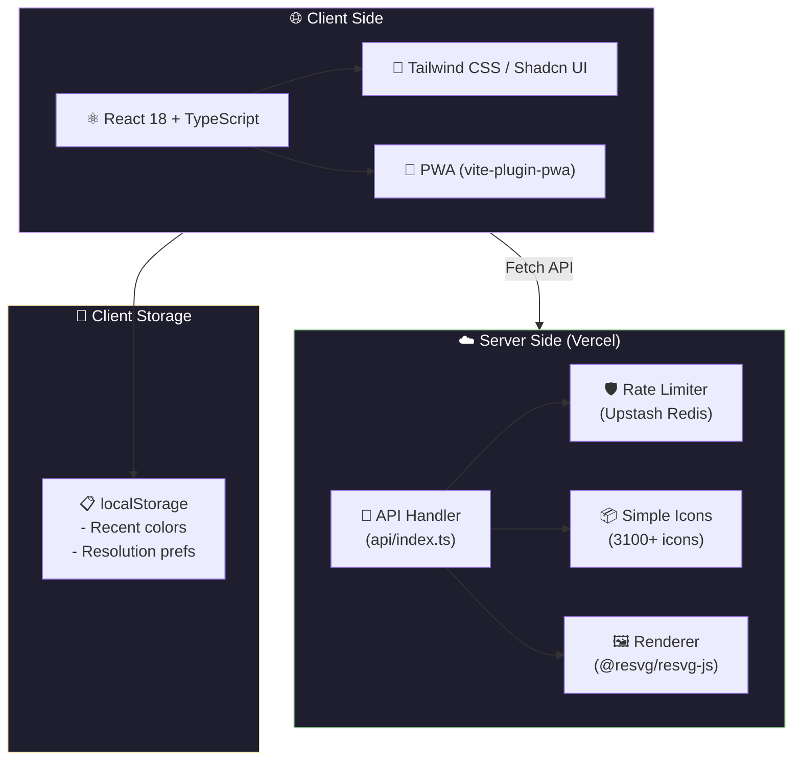
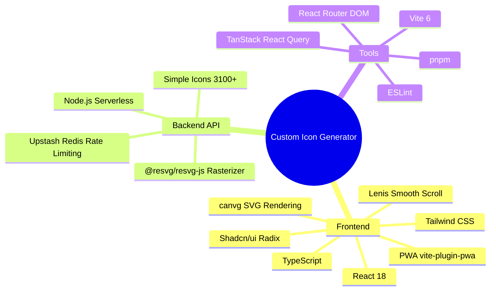

# 🎨 Custom Icon Generator

<p align="center">
  <a href="https://custom-icon-generator.vercel.app">
    <picture>
      <source media="(prefers-color-scheme: dark)" srcset="https://custom-icon-generator.vercel.app/api/asset/rectangles.svg?color=61dafb&background=0a0a0f&size=64">
      
    </picture>
  </a>
  <br>
  <b>Search, customize, and download</b> 3,100+ brand icons<br>
  in <b>SVG</b>, <b>PNG</b>, or <b>ICO</b> — with a powerful REST API.
</p>

<p align="center">
  <a href="https://custom-icon-generator.vercel.app"></a>
  <a href="https://custom-icon-generator.vercel.app/playground"></a>
  <a href="#-rest-api"></a>
  <br>
  
  
  
  
  
  
</p>

<p align="center">
  
  
  
  
  
  
  
</p>

---

## 📋 Table of Contents

- [✨ Features](#-features)
- [🧩 Architecture](#-architecture)
- [🌐 REST API](#-rest-api)
  - [Icons Endpoints](#icons-endpoints)
  - [Asset Endpoints](#asset-endpoints)
  - [Random & Meta Endpoints](#random--meta-endpoints)
  - [Color, Size & Background Reference](#color-size--background-reference)
  - [Examples](#-examples)
- [🛡️ Rate Limiting](#️-rate-limiting)
- [💻 Tech Stack](#-tech-stack)
- [🚀 Development](#-development)
- [📦 Deployment](#-deployment)
- [🎮 Usage Guide](#-usage-guide)
- [🤝 Contributing](#-contributing)
- [📄 License](#-license)

---

## ✨ Features

| Feature | Description |
| :------ | :---------- |
| 🎨 **Dynamic Color Picker** | Apply any hex color to icons in real-time |
| 📚 **Recent Colors** | Save and reuse your favorite palettes |
| 🔍 **Powerful Search** | Filter 3,100+ icons by name or slug with smart sorting |
| 📐 **Custom Resolution** | Configure PNG/ICO downloads up to 4096×4096px |
| 📦 **Batch Download** | Select multiple icons, download as a single ZIP |
| 🔬 **SVG Code Viewer** | Inspect and copy colored SVG markup with syntax highlighting |
| 🌐 **API Playground** | Interactive docs at [`/playground`](https://custom-icon-generator.vercel.app/playground) — test every endpoint live |
| ⚡ **Public REST API** | Programmatic access: SVG, PNG, ICO, JSON |
| 🖼️ **Background Support** | Add solid or transparent backgrounds to raster outputs |
| 📱 **PWA Ready** | Install as a progressive web app for offline access |

---

## 🧩 Architecture



---

## 🌐 REST API

Full interactive docs available at **[`/playground`](https://custom-icon-generator.vercel.app/playground)**.  
All endpoints are `GET`, CORS-enabled (`*`), and rate-limited per IP or API key.

<details>
<summary><b>📋 Quick Reference — click to expand</b></summary>

### Icons Endpoints

| Method | Path | Description |
| :----- | :--- | :---------- |
| `GET` | `/api/search?q=<query>` | 🔍 Fuzzy search by name or slug. Optional `?limit=` (max 100). |
| `GET` | `/api/icons` | 📋 Lightweight list `[{title, slug, hex}]`. Optional `?page=&limit=`. |
| `GET` | `/api/icons/all` | 📦 Full dataset including SVG path data (~3 MB). Cached 24h. |
| `GET` | `/api/icons/{slug}` | 📄 Single icon metadata: title, slug, hex, path, svg, source, guidelines, license. |

### Asset Endpoints

| Method | Path | Description |
| :----- | :--- | :---------- |
| `GET` | `/api/asset/{slug}.svg` | 🎨 Colored SVG. Supports `?color=`, `?size=`, `?background=`. |
| `GET` | `/api/asset/{slug}.png` | 🖼️ Rasterized PNG via resvg. Default 128×128px. |
| `GET` | `/api/asset/{slug}.ico` | 🏷️ ICO format (PNG-in-ICO). Ideal for favicons. Default 32×32px. |
| `GET` | `/api/asset/{slug}.json` | 📊 Icon metadata + pre-built SVG string. |

### Random & Meta Endpoints

| Method | Path | Description |
| :----- | :--- | :---------- |
| `GET` | `/api/random.svg` | 🎲 Random icon as SVG. Never cached. |
| `GET` | `/api/random.json` | 🎲 Random icon as JSON with full metadata. Never cached. |
| `GET` | `/api/stats` | 📈 Total icon count, simple-icons version, formats, and rate limit tiers. |

### Color, Size & Background Reference

| Parameter | Values | Description |
| :-------- | :----- | :---------- |
| `?color=` | `brand` / `random` / `#hex` | `brand` = official brand color (default). `random` = new color each request. |
| `?size=` | `16–512` / `random` | Width/height in pixels for raster outputs, or `random` (16–512px). |
| `?background=` | `default` / `transparent` / `#hex` | `default` = white for PNG/ICO, none for SVG. `transparent` = no background. |

### 📦 Response Headers

```
X-RateLimit-Tier: anonymous
X-RateLimit-Limit: 60
X-RateLimit-Remaining: 57
X-RateLimit-Reset: 1718000000
X-Color: FF5733          ← included when color=random
```

</details>

<details>
<summary><b>📝 Examples — click to expand</b></summary>

```bash
# Random color, specific size
curl "https://custom-icon-generator.vercel.app/api/asset/github.svg?color=random&size=64"

# Brand color, specific background
curl "https://custom-icon-generator.vercel.app/api/asset/react.png?color=brand&background=ffffff"

# Custom color + random size
curl "https://custom-icon-generator.vercel.app/api/asset/typescript.svg?color=3178c6&size=random"

# Random icon with transparent background
curl "https://custom-icon-generator.vercel.app/api/random.svg?color=random&background=transparent"

# Full metadata
curl "https://custom-icon-generator.vercel.app/api/icons/vscode"
```

**Embedding in GitHub READMEs:**

```markdown
<!-- Random color (cached by GitHub proxy — use a specific hex for consistency) -->


<!-- With background for dark theme visibility -->

```

</details>

---

## 🛡️ Rate Limiting

Sliding-window algorithm backed by [Upstash Redis](https://upstash.com). Limits scale by endpoint cost.

| Tier | How to activate | 🗂️ Metadata | 🎨 SVG | 🖼️ PNG / ICO | 📦 Full dataset |
| :--- | :-------------- | :----------: | :----: | :-----------: | :-------------: |
| **Anonymous** | No key (per IP) | 200/min | 60/min | 20/min | 5/min |
| **Basic** | `X-API-Key: <key>` | 800/min | 400/min | 150/min | 30/min |
| **Master** | `X-API-Key: <key>` | Unlimited | Unlimited | Unlimited | Unlimited |

> [!TIP]
> On `429 Too Many Requests`, a `Retry-After` header is included. Unrecognized keys silently fall back to anonymous — the API never reveals whether a key exists.

<details>
<summary><b>🔑 Generating API Keys</b></summary>

```bash
node -e "const{randomBytes}=require('crypto');console.log(randomBytes(32).toString('hex'))"
```

Add the output to `API_KEYS_BASIC` or `API_KEYS_MASTER` (comma-separated) in your environment variables.

> [!NOTE]
> The `/playground` page has an **"Import collection"** button to download a pre-configured Postman or Insomnia file with all endpoints and the correct base URL.

</details>

---

## 💻 Tech Stack



---

## 🚀 Development

<details open>
<summary><b>Getting Started</b></summary>

**Prerequisites:** Node.js v18+ and [pnpm](https://pnpm.io/installation).

```bash
# 1. Clone the repository
git clone https://github.com/kauafpssx/custom-icon-generator.git
cd custom-icon-generator

# 2. Install dependencies
pnpm install

# 3. Configure environment
cp .env.example .env.local
# Fill in UPSTASH_REDIS_REST_URL and UPSTASH_REDIS_REST_TOKEN
# Leave blank for local dev — rate limiting falls back to in-memory

# 4. Start the dev server
pnpm dev
# → http://localhost:8080
```

</details>

<details>
<summary><b>Available Scripts</b></summary>

| Command | Description |
| :------ | :---------- |
| `pnpm dev` | 🚀 Start Vite dev server on port 8080 |
| `pnpm build` | 📦 Production build |
| `pnpm build:dev` | 🔧 Development build |
| `pnpm preview` | 👁️ Preview production build |
| `pnpm lint` | 🔍 Run ESLint |

</details>

---

## 📦 Deployment

<details>
<summary><b>Deploying to Vercel</b></summary>

1. Import the repository in the [Vercel dashboard](https://vercel.com/new).
2. Set environment variables under **Project → Settings → Environment Variables**:

   | Variable | Description |
   | :------- | :---------- |
   | `UPSTASH_REDIS_REST_URL` | From [Upstash console](https://console.upstash.com) |
   | `UPSTASH_REDIS_REST_TOKEN` | From [Upstash console](https://console.upstash.com) |
   | `API_KEYS_BASIC` | Comma-separated basic-tier keys |
   | `API_KEYS_MASTER` | Comma-separated master-tier keys |

3. Deploy. The `api/index.ts` serverless function is auto-detected.

</details>

---

## 🎮 Usage Guide

<details open>
<summary><b>Web Interface</b></summary>

| Action | How |
| :----- | :-- |
| 🔍 **Search** | Type a brand name (e.g., `GitHub`) or slug (e.g., `github`) in the search bar. Toggle A–Z, Z–A, or Random sort. |
| 🎨 **Color** | Click the color swatch to open the hex picker, hit **Shuffle** for a random color, or **Bookmark** to save it to your recent list. |
| 📐 **Resolution** | Click the resolution button (e.g., `256×256`) to configure PNG/ICO size, up to 4096px. |
| ⬇️ **Download** | Each icon card has SVG / PNG / ICO buttons. Select 2+ cards to enable the batch panel — downloads a ZIP. |
| 🌐 **API Playground** | Click **API System** or visit [`/playground`](https://custom-icon-generator.vercel.app/playground) to explore every endpoint interactively. Authorize with your API key to unlock higher rate limits. |

</details>

<details>
<summary><b>API Integration</b></summary>

**Using color=random in your application:**

The API generates a new random color on every request. Use it for dynamic UIs where you want variety:

```javascript
// Fetch an icon with a random color
const response = await fetch(
  "https://custom-icon-generator.vercel.app/api/asset/react.svg?color=random"
);
const svgBlob = await response.blob();

// Each call returns a different color!
```

**Getting the resolved random color:**

```javascript
const response = await fetch(
  "https://custom-icon-generator.vercel.app/api/asset/react.svg?color=random"
);
const resolvedColor = response.headers.get("X-Color"); // e.g., "FF5733"
```

</details>

---

## 🤝 Contributing

1. 🐛 Open an [Issue](https://github.com/kauafpssx/custom-icon-generator/issues) to report bugs or propose enhancements.
2. 🔀 Submit a [Pull Request](https://github.com/kauafpssx/custom-icon-generator/pulls) with your changes.
3. 📝 Make sure `pnpm lint` and `pnpm build` pass.

---

## 📄 License

Distributed under the **MIT License**.

<p align="center">
  <sub>Made with ❤️ by <a href="https://github.com/kauafpssx">Kauã Ferreira</a></sub>
  <br>
  <sub>Powered by <a href="https://simpleicons.org/">Simple Icons</a> · 3,100+ icons under respective brand trademarks</sub>
</p>
